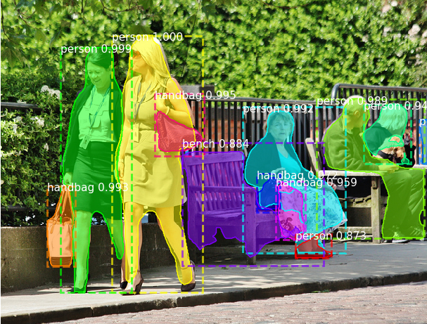

# pytorch-mask-rcnn

This is a Pytorch implementation of [Mask R-CNN](https://arxiv.org/abs/1703.06870) that is in large parts based on Matterport's
[Mask_RCNN](https://github.com/matterport/Mask_RCNN). Matterport's repository is an implementation on Keras and TensorFlow.
The following parts of the README are excerpts from the Matterport README. Details on the requirements, training on MS COCO
and detection results for this repository can be found at the end of the document.

The Mask R-CNN model generates bounding boxes and segmentation masks for each instance of an object in the image. It's based
on Feature Pyramid Network (FPN) and a ResNet101 backbone.

The next four images visualize different stages in the detection pipeline:

##### 1. Anchor sorting and filtering
The Region Proposal Network proposes bounding boxes that are likely to belong to an object. Positive and negative anchors
along with anchor box refinement are visualized.

##### 2. Bounding Box Refinement
This is an example of final detection boxes (dotted lines) and the refinement applied to them (solid lines) in the second stage.

##### 3. Mask Generation
Examples of generated masks. These then get scaled and placed on the image in the right location.

##### 4. Composing the different pieces into a final result

## Requirements
* Python 3
* Pytorch 0.3
* matplotlib, scipy, skimage, h5py

## Installation
1. Clone this repository.

        git clone https://github.com/multimodallearning/pytorch-mask-rcnn.git

    
2. We use functions from two more repositories that need to be build with the right `--arch` option for cuda support.
The two functions are Non-Maximum Suppression from ruotianluo's [pytorch-faster-rcnn](https://github.com/ruotianluo/pytorch-faster-rcnn)
repository and longcw's [RoiAlign](https://github.com/longcw/RoIAlign.pytorch).

    | GPU | arch |
    | --- | --- |
    | TitanX | sm_52 |
    | GTX 960M | sm_50 |
    | GTX 1070 | sm_61 |
    | GTX 1080 (Ti) | sm_61 |

        cd nms/src/cuda/
        nvcc -c -o nms_kernel.cu.o nms_kernel.cu -x cu -Xcompiler -fPIC -arch=[arch]
        cd ../../
        python build.py
        cd ../

        cd roialign/roi_align/src/cuda/
        nvcc -c -o crop_and_resize_kernel.cu.o crop_and_resize_kernel.cu -x cu -Xcompiler -fPIC -arch=[arch]
        cd ../../
        python build.py
        cd ../../

3. As we use the [COCO dataset](http://cocodataset.org/#home) install the [Python COCO API](https://github.com/cocodataset/cocoapi) and
create a symlink.

        ln -s /path/to/coco/cocoapi/PythonAPI/pycocotools/ pycocotools
    
4. Download the pretrained models on COCO and ImageNet from [Google Drive](https://drive.google.com/open?id=1LXUgC2IZUYNEoXr05tdqyKFZY0pZyPDc).

## Demo

To test your installation simply run the demo with

    python demo.py

It works on CPU or GPU and the result should look like this:

## Training on COCO
Training and evaluation code is in coco.py. You can run it from the command
line as such:

    # Train a new model starting from pre-trained COCO weights
    python coco.py train --dataset=/path/to/coco/ --model=coco

    # Train a new model starting from ImageNet weights
    python coco.py train --dataset=/path/to/coco/ --model=imagenet

    # Continue training a model that you had trained earlier
    python coco.py train --dataset=/path/to/coco/ --model=/path/to/weights.h5

    # Continue training the last model you trained. This will find
    # the last trained weights in the model directory.
    python coco.py train --dataset=/path/to/coco/ --model=last

If you have not yet downloaded the COCO dataset you should run the command
with the download option set, e.g.:

    # Train a new model starting from pre-trained COCO weights
    python coco.py train --dataset=/path/to/coco/ --model=coco --download=true

You can also run the COCO evaluation code with:

    # Run COCO evaluation on the last trained model
    python coco.py evaluate --dataset=/path/to/coco/ --model=last

The training schedule, learning rate, and other parameters can be set in coco.py.

## Results

COCO results for bounding box and segmentation are reported based on training
with the default configuration and backbone initialized with pretrained
ImageNet weights. Used metric is AP on IoU=0.50:0.95.

|    | from scratch | converted from keras | Matterport's Mask_RCNN | Mask R-CNN paper |
| --- | --- | --- | --- | --- |
| bbox | t.b.a. | 0.347 | 0.347 | 0.382 |
| segm | t.b.a. | 0.296 | 0.296 | 0.354 |

